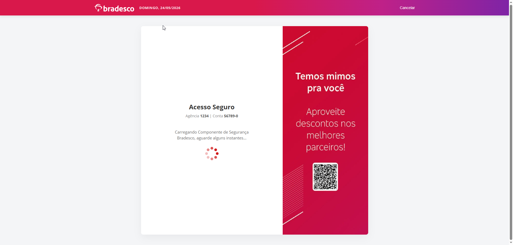
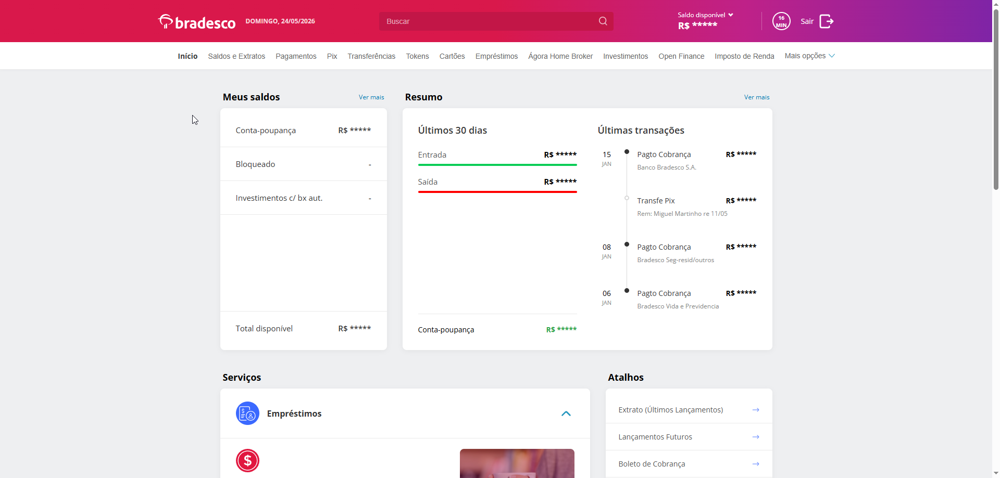
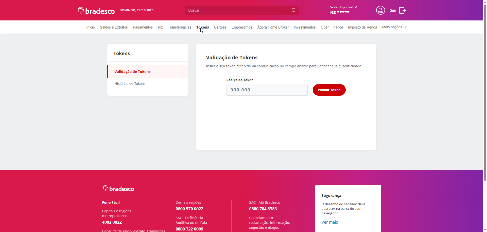
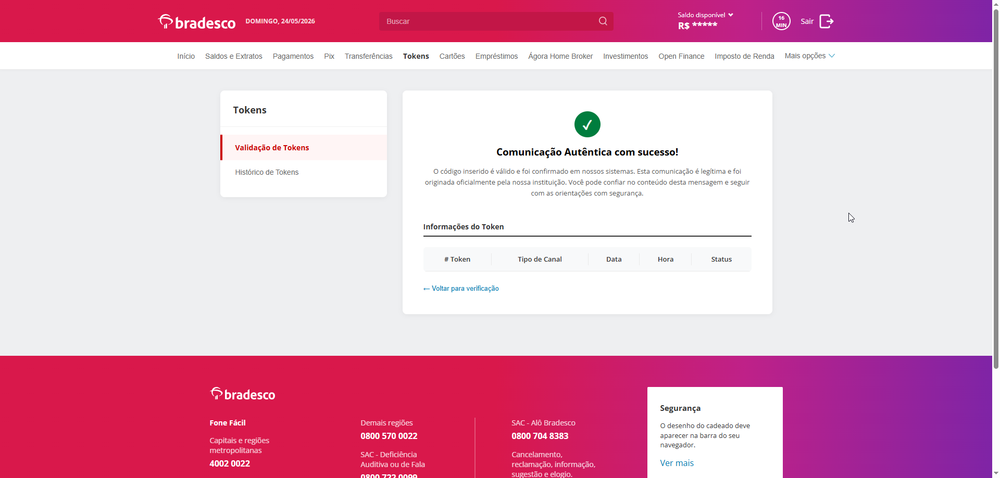
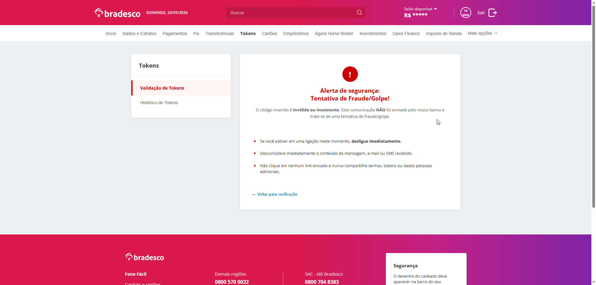
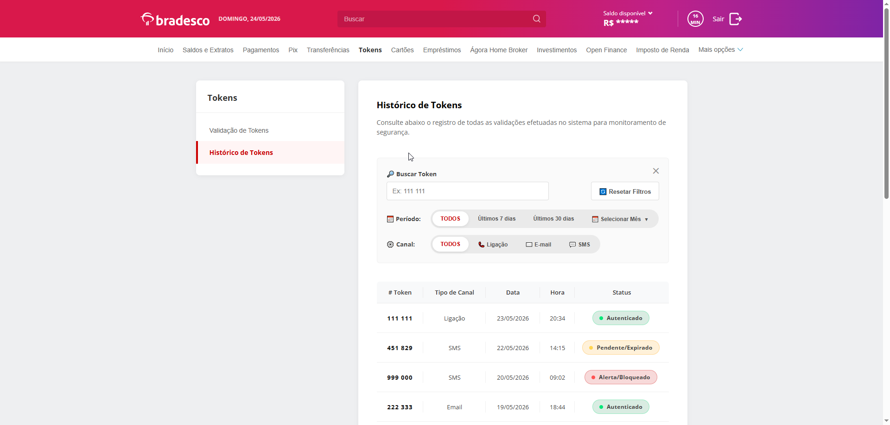

<a id="readme-top"></a>

<div align="center">
  
<h1>Trust Token</h1>
<h6>Autenticação de comunicações bancárias através de tokens dinâmicos</h6>
</div>

***

<div align="center">
  
  [](https://docs.oracle.com/en/java/javase/21/index.html)
  [](https://spring.io/projects/spring-boot#overview)
  [](https://img.shields.io/badge/Maven-3.9.14-%23C71A36?logo=apachemaven&logoColor=%23C71A36)
  [](https://www.postgresql.org/)
  [](https://render.com/)
  
</div>
<hr>

<div align="center">
  <a href="https://github.com/MachadoCodes/api-tokens-dinamicos/new/main?filename=README.md#readme-top">
    
  </a>
</div>

<br>

<!-- TABLE OF CONTENTS -->
<details>
  <summary>Guia de conteúdo</summary>
  <ol>
    <li>
      <a href="#sobre-o-projeto">Sobre o Projeto</a>
      <ul>
        <li><a href="#contextualização">Contextualização</a></li>
        <li><a href="#a-proposta">A Proposta</a></li>
      </ul>
    </li>
    <li><a href="#tecnologias-utilizadas">Tecnologias Utilizadas</a></li>
    <li><a href="#como-funciona">Como Funciona</a></li>
    <li><a href="#interface-do-usuario-frontend"></a>Interface do Usuário</li>
    <li><a href="#arquitetura-do-projeto">Arquitetura do projeto</a></li>
    <li><a href="#estrutura-de-pastas"></a>Estrutura de Pastas</li>
    <li><a href="#getting-started">Getting Started</a></li>
    <li><a href="#guia-de-endpoints">Guia de Endpoints</a></li>
    <li><a href="#testando-a-api-na-pratica-postman"></a>Testando a API na Prática</li>
    <li><a href="#testes-automatizados-junit">Testes Automatizados</a></li>
    <li><a href="#licença">Licença</a></li>
    <li><a href="#agradecimentos">Agradecimentos</a></li>
    <li><a href="#contato">Contato</a></li>
  </ol>
</details>

<br>

## Sobre o Projeto
<p>
  O projeto TrustToken é uma API REST desenvolvida para geração, vinculação e armazenamento de tokens dinâmicos associados a comunicações realizadas por instituições financeiras. A solução tem como objetivo mitigar fraudes baseadas em engenharia social, especialmente golpes como o de falsa comunicação ou falso funcionário, permitindo que o cliente verifique a autenticidade das mensagens recebidas. Por meio da validação de tokens únicos vinculados a cada comunicação, o sistema adiciona uma camada extra de segurança, aumentando a confiabilidade das interações entre clientes e instituições financeiras.
</p>

### Contextualização
<p>
  O aumento de fraudes financeiras baseadas em engenharia social representa um dos principais desafios de segurança no setor bancário. Criminosos utilizando da engenharia social exploram fatores como urgência e autoridade para manipular vítimas e obter informações sensíveis.
</p>
<p> 
  Segundo a Federação Brasileira de Bancos (FEBRABAN):
</p>
<ul>
  <li>Em 2024, o golpe da falsa central destacou-se como o mais aplicado contra a população idosa.</li>
  <li>Cerca de 105 mil pessoas já foram vítimas dessa modalidade de fraude no Brasil.</li>
</ul>

### A Proposta
<p>Nossa arquitetura propõe um fluxo de segurança baseada na geração de tokens dinâmicos associados a cada comunicação realizada pela instituição financeira. Nesse modelo, sempre que uma comunicação é enviada ou um contato é iniciado com o cliente, um código único e aleatório é gerado, vinculado àquela interação e armazenado em um histórico para autenticação ativa que possibilita ao usuário confirmar a autenticidade da comunicação antes de tomar qualquer ação, reduzindo o risco de exposição de dados sensíveis a fraudes.</p>

<br>

<p align="right">(<a href="#readme-top"> ▲ voltar ao topo ▲ </a>)</p>

## Tecnologias utilizadas

<div align="center">
  
| Tecnologia | Versão | Função |
| :--- | :--- | :--- |
| Java | 21 | Linguagem Base |
| Spring Boot | 3.5.13 | Framework Backend |
| PostgreSQL | 18 | Banco de Dados |
| Maven  | 3.9.14 | Gerenciador de dependências e build |
| JPA / Hibernate | - | Persistência de dados e mapeamento objeto-relacional |
| Spring Security | - | Mecanismos de Criptografia, Filtros e Controle de Acesso |
| JWT (JJWT) | - | Emissão e Validação Estrita de Tokens de Acesso Stateless |
| Render | PaaS | Hospedagem em Nuvem (Cloud Hosting) e Banco de Dados |

</div>

<p><i>
  Nota: Este repositório contém o código-fonte da API (Backend). A interface gráfica do usuário (Frontend) foi desenvolvida utilizando HTML, CSS e JavaScript Vanilla, e realiza a comunicação com esta API via requisições assíncronas (Fetch) e pode ser encontrada aqui: <a href="https://github.com/MiguelRebequi/frontend-api-tokens-dinamicos">frontend-api-tokens-dinamicos</a>.
</i></p>

<br>

<p align="right">(<a href="#readme-top"> ▲ voltar ao topo ▲ </a>)</p>

## Como Funciona
<p>
<ol>
<li>A instituição financeira entra em contato ou envia uma mensagem ao cliente.</li>
  <br>
<li>O sistema gera um token único e aleatório para cada comunicação realizada.</li>
  <br>
<li>O token é vinculado à mensagem, caso seja SMS ou e-mail, e é armazenado no banco de dados.
   *Obs.: Em versões futuras, para comunicações via ligação, o token será informado ao cliente por meio de um sistema de TTS (Text-to-Speech) logo no início da chamada.</li>
  <br>
<li>O cliente recebe a comunicação, que aparenta ser de uma instituição financeira.</li>
  <br>
<li>A comunicação deve conter o token em destaque no topo da mensagem. Caso a mensagem recebida não contenha um token em destaque, o cliente pode considerá-la falsa e deve desconsiderá-la.</li>
  <br>
<li>De posse do token, o cliente acessa sua conta por meio do aplicativo ou página web oficial da instituição e navega até a seção de verificação de tokens.</li>
  <br>
<li>
  A seção de tokens apresenta o histórico de comunicações, incluindo:
<ul>
  <br>
  <li>código do token vinculado à mensagem;</li>
  <li>data e hora em que foi gerado;</li>
  <li>tipo de comunicação (SMS, e-mail ou ligação).</li>
</ul>
</li>
  <br>
<li>
  O cliente insere o token recebido em um campo para validação. O sistema verifica sua existência, vínculo com a conta e validade, retornando um dos seguintes resultados:
<ul>
  <br>
  <li>Comunicação autêntica, quando o token é válido. Nesse caso, a comunicação é legítima e proveniente da instituição financeira;</li>
  <li>Mensagem fraudulenta, quando o token é inválido ou inexistente. Nesse caso, a comunicação não é legítima e tem origem em agentes maliciosos. O cliente deve desconsiderar a mensagem, evitando possíveis tentativas de obtenção de informações sensíveis ou a realização de transações fraudulentas.</li>
</ul>
</li>
</ol>
</p>

<br>

<p align="right">(<a href="#readme-top"> ▲ voltar ao topo ▲ </a>)</p>

## Interface do Usuário (Frontend)

<div align="center">
    
  <br>
  
  <br>
  
  <br>
  
  <br>
  
  <br>
  
  <br>
  
</div>

<br>

<p align="right">(<a href="#readme-top"> ▲ voltar ao topo ▲ </a>)</p>

## Arquitetura do projeto

A aplicação foi desenhada sob o paradigma **Client-Server (Desacoplado)**, onde o backend atua exclusivamente como uma API RESTful (fornecendo e consumindo dados via JSON), enquanto o frontend opera de forma totalmente independente.

A API em si foi estruturada seguindo o padrão de **Arquitetura em Camadas (Layered Architecture)**, o que garante a separação de responsabilidades, facilidade de manutenção e alta coesão do ecossistema:

<ul>
  <li><b>Controller (Camada de Exposição):</b> Expõe as rotas REST da aplicação e gerencia as requisições HTTP recebidas, mapeando os endpoints e retornando respostas padronizadas em JSON.</li>
  <li><b>Service (Camada de Negócio):</b> Concentra as regras de negócio cruciais, como a orquestração de geração de códigos, controle de tempo de vida (TTL), inativação pós-uso e delegação de envio de mensageria.</li>
  <li><b>Repository (Camada de Persistência):</b> Interfaces que herdam do JpaRepository para gerenciar a comunicação e realizar as consultas SQL diretamente no banco de dados relacional.</li>
  <li><b>Security (Camada de Blindagem):</b> Filtro personalizado (<code>JwtFilter</code>) focado em autenticação <b>Stateless</b>, que intercepta as requisições e valida assinaturas matemáticas, aliado ao hash robusto de senhas via <code>BCryptPasswordEncoder</code>.</li>
</ul>

<p><i>
  Nota: Este repositório contém o código-fonte da API (Backend). A interface gráfica do usuário (Frontend) atua como o cliente consumindo esses serviços, foi desenvolvida utilizando HTML, CSS e JavaScript Vanilla, e realiza a comunicação com esta API via requisições assíncronas (Fetch).
</i></p>

```
┌─────────────────────────────────────────────────────────────┐
│                     Frontend (Vanilla JS)                   │
│ (Interface do Usuário, Interceptação de Fetch, LocalStorage)│
└──────────────────────┬──────────────────────────────────────┘
                       │ Requisições HTTP (CORS Enabled)
┌──────────────────────▼──────────────────────────────────────┐
│                    API REST (Spring Boot)                   │
│       (Security Filter Chain, JWT Validation, Controllers)  │
└──────────────────────┬──────────────────────────────────────┘
                       │ Lógica de Negócio (Services)
┌──────────────────────▼──────────────────────────────────────┐
│                  Core Validation Engine                     │
│    (Geração Dinâmica, Controle de TTL, Mock de Mensageria)  │
└──────────────────────┬──────────────────────────────────────┘
                       │ Persistência JPA / Hibernate
┌──────────────────────▼──────────────────────────────────────┐
│                   PostgreSQL (Render)                       │
│       (Armazenamento Seguro e Relacional de Histórico)      │
└─────────────────────────────────────────────────────────────┘
```

<br>

<p align="right">(<a href="#readme-top"> ▲ voltar ao topo ▲ </a>)</p>

## Estrutura de Pastas

```text
api-tokens-dinamicos/
├── img/                        # Imagens e assets visuais utilizados na documentação
├── src/
│   ├── main/
│   │   ├── java/com/GMR/api_tokens_dinamicos/
│   │   │   ├── controller/     # Endpoints REST e roteamento HTTP das requisições
│   │   │   ├── dto/            # Objetos de Transferência de Dados (isolam a Model da View)
│   │   │   ├── model/          # Entidades JPA que representam as tabelas no banco de dados
│   │   │   ├── repository/     # Interfaces de comunicação e persistência com o PostgreSQL
│   │   │   ├── security/       # Configurações de CORS, Filtros JWT e criptografia BCrypt
│   │   │   └── service/        # Regras de negócio cruciais, geração e mock de mensageria
│   │   └── resources/
│   │       └── application.properties # Credenciais e configurações de ambiente (Local/Render)
│   └── test/                   # Suíte de testes automatizados (JUnit) da aplicação
├── Dockerfile                  # Configuração para conteinerização e deploy da API
├── LICENSE.txt                 # Licença MIT detalhando as permissões de uso do projeto
└── pom.xml                     # Gerenciador de dependências e ciclo de vida do Maven
```

<br>

<p align="right">(<a href="#readme-top"> ▲ voltar ao topo ▲ </a>)</p>

## Getting started
<p>Siga estas instruções para configurar e executar o projeto em sua máquina local para fins de desenvolvimento e teste.</p>
<p>
  
### Pré-requisitos

<p>Antes de começar, você precisará ter instalado:</p>
<ul>
<li>Java JDK 21: O projeto utiliza recursos da versão 21 mais recentes do Java.</li>

<li>Maven 3.9.14: Gerenciador de dependências.</li>

<li>PostgreSQL: Banco de dados relacional para persistência (Local ou acesso ao Render).</li>

<li>Postman: Para realizar testes das chamadas aos endpoints da API.</li>

<li>IDE: IDE para a linguagem Java. Recomendamos a IntelliJ IDEA.</li>

<li>Sistema operacional: Estar utilizando o windows versão 8 ou superior.</li>
</ul>
</p>

***

<div>
  
  | Java JDK 21 |
  | ----------- |
  
</div>

<p>Antes de instalar, verifique se você já possui a versão necessária do java rodando na sua máquina:</p>

<ol>
<li>Abra o Prompt de Comando no Windows. Para isso, utilize o atalho <code>win+r</code> para abrir a caixa de diálogo Executar (Run).</li>

<li>Na caixa de diálogo digite <code>cmd</code> e dê um enter.</li>

<li>No prompt de  comando (cmd) digite o seguinte comando e aperte a tecla enter:</li>

 ```sh
   java --version
   ```
</ol>

<ul>  
<li>Caso apareça algo como "java 21.x.x", você já está utilizando a versão 21.</li>
<li>Caso apareça "'java' não é reconhecido como um comando interno ou externo, programa operável ou arquivo em lote.", você não possui o Java instalado.</li>
<li>Caso esteja com uma versão antiga do java será necessário atualizá-la.</li>
</ul>

***

<div>
  
  | Maven 3.9.14 |
  | ------------ |
  
</div>

<p>Antes de instalar, verifique se você já possui a versão necessária do maven rodando na sua máquina:</p>

<ol>
<li>Abra o Prompt de Comando no Windows. Para isso, utilize o atalho <code>win+r</code> para abrir a caixa de diálogo Executar (Run).</li>

<li>Na caixa de diálogo digite <code>cmd</code> e dê um enter.</li>

<li>No prompt de  comando (cmd) digite o seguinte comando e aperte a tecla enter:</li>

 ```sh
   mvn --version
   ```
</ol>

<ul>  
<li>Caso apareça algo como "Apache Maven 3.9.x", você já está utilizando a versão necessária.</li>
<li>Caso apareça "'Maven' não é reconhecido como um comando interno ou externo, programa operável ou arquivo em lote.", você não possui o Java instalado.</li>
<li>Caso esteja com uma versão antiga do Maven será necessário atualizá-la.</li>
</ul>


<p>
  Clone o repositório:
  
```
git clone https://github.com/MachadoCodes/api-tokens-dinamicos
```

Configure as credenciais do banco de dados no arquivo application.properties.

Execute o comando:
```
mvn spring-boot:run
```

</p>

<br>

<p align="right">(<a href="#readme-top"> ▲ voltar ao topo ▲ </a>)</p>

## Guia de Endpoints

<div align="center">
  
  | Método | Endpoint | Protegido | Descrição |
  | :--- | :--- | :---: | :--- |
  | POST | `/usuarios` | Não | Registra um novo usuário no sistema. |
  | POST | `/api/v1/auth/login` | Não | Autentica uma conta bancária (Agência/Conta/Senha) e retorna o Token JWT. |
  | POST | `/api/v1/tokens/gerar` | Sim | Gera um token dinâmico de 6 dígitos e simula o disparo de mensagens para o cliente. |
  | POST | `/api/v1/tokens/validar` | Sim | Valida de forma blindada se o código inserido é legítimo, ativo e expira o token pós-sucesso. |
  | GET | `/usuarios/{id}/contas/{contaId}/historico-tokens` | Sim | Exibe a trilha de auditoria e histórico de todas as comunicações da conta. |
  
</div>

<br>

<p align="right">(<a href="#readme-top"> ▲ voltar ao topo ▲ </a>)</p>

## Testando a API na Prática (Postman)
O passo a passo com o Postman. Como o TrustToken é uma API protegida por segurança (JWT), o fluxo de teste exige etapas (Logar -> Pegar Token -> Validar). Mostrar esse passo a passo é o padrão ouro de usabilidade para desenvolvedores.

Como a API é blindada pelo Spring Security, o teste das rotas exige autenticação prévia:

1. **Gere o Token de Acesso (JWT):**
   * Faça uma requisição `POST` para `/api/v1/auth/login` com as credenciais da conta.
   * Copie o token retornado na resposta.
2. **Autorize as Requisições Seguras:**
   * No Postman, vá na aba **Authorization**, selecione **Bearer Token** e cole o JWT.
3. **Simule uma Comunicação (Geração de Token Numérico):**
   * Faça um `POST` para `/api/v1/tokens/gerar`.
   * *Dica:* Acompanhe o terminal da sua IDE (IntelliJ) para ver o simulador de mensageria imprimindo o SMS, E-mail ou Ligação formatados!
4. **Valide o Código:**
   * Faça um `POST` para `/api/v1/tokens/validar` inserindo o código de 6 dígitos gerado no passo anterior.

<br>

<p align="right">(<a href="#readme-top"> ▲ voltar ao topo ▲ </a>)</p>

## Testes Automatizados (JUnit)
<p>
  O projeto conta com uma cobertura abrangente de testes automatizados utilizando **JUnit**. 
Para executar a suíte de testes localmente, rode o seguinte comando no terminal:
</p>

```
sh
mvn test
```

<br>

<p align="right">(<a href="#readme-top"> ▲ voltar ao topo ▲ </a>)</p>

## Licença
<p>Distribuído sob a licença MIT. Veja <code>LICENSE.txt</code> para mais informações.</p>

<br>

<p align="right">(<a href="#readme-top"> ▲ voltar ao topo ▲ </a>)</p>

## Agradecimentos

<p>
  Agradecemos ao corpo docente da Universidade Anhembi Morumbi (UAM) pela mentoria acadêmica durante todo o primeiro semestre de 2026. Expressamos nossa gratidão especial aos professores que nos guiaram e impulsionaram o desenvolvimento prático desta solução focada em resolver problemas reais de uma sociedade conectada:

* **Profa. Me. Cassilene de Assis:** Unidade Curricular de Sistemas Distribuídos e Mobile.
* **Prof. Esp. Raul de Oliveira Bastos:** Unidade Curricular de Usabilidade, Desenvolvimento Web, Mobile e Jogos.
</p>

<br>

<p align="right">(<a href="#readme-top"> ▲ voltar ao topo ▲ </a>)</p>

## Contato

<table align="center">
  <tr>
    <td align="center" valign="top">
      <a href="https://github.com/MachadoCodes">
        
      </a>
      <br/>
      <p><b>Renato Gonçalves Machado</b></p>
      <p><a href="">LinkedIn</a> | <a href="https://github.com/MachadoCodes">GitHub</a></p>
    </td>
    <td align="center" valign="top">
      <a href="https://github.com/MiguelRebequi">
        
      </a>
      <br/>
      <p><b>Miguel Martinho Rebequi</b></p>
      <p><a href="https://www.linkedin.com/in/miguel-martinho-rebequi-08753b271/">LinkedIn</a> | <a href="https://github.com/MiguelRebequi">GitHub</a></p>
    </td>
    <td align="center" valign="top">
      <a href="https://github.com/GuilhermeChiuchi">
        
      </a>
      <br/>
      <p><b>Guilherme Chiuchi Pereira</b></p>
      <p><a href="">LinkedIn</a> | <a href="https://github.com/GuilhermeChiuchi">GitHub</a></p>
    </td>
  </tr>
</table>

<br>

<p align="right">(<a href="#readme-top"> ▲ voltar ao topo ▲ </a>)</p>

